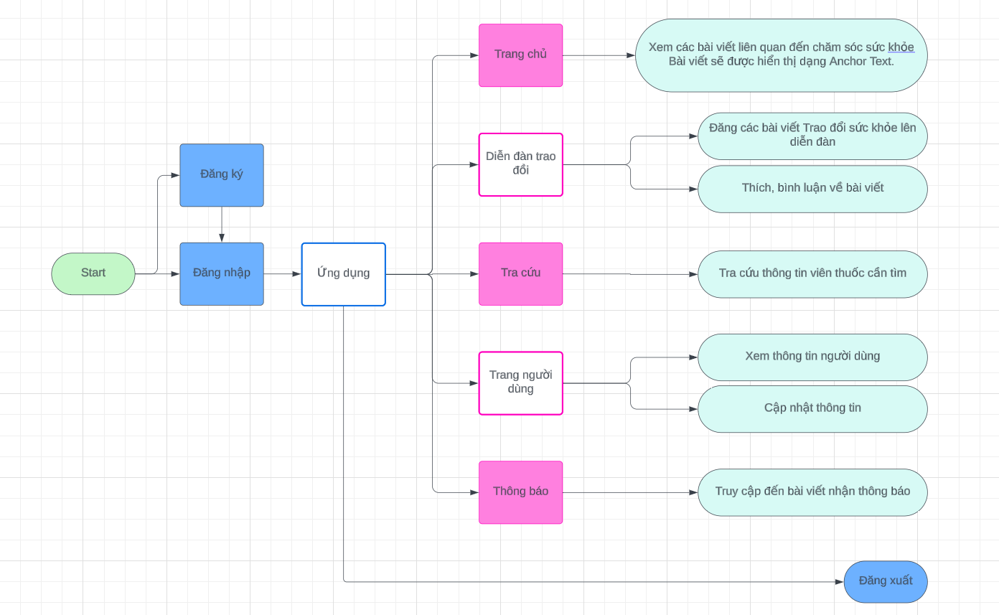

  

<h1 align="center">Nhom5 - MedicalWeb.</h1>

## Danh sách thành viên:
| MSSV       | Họ và Tên       | Email                  | Github                                                                                                                      |
| ---------- | --------------- | ---------------------- | --------------------------------------------------------------------------------------------------------------------------- |
| `21522608` | Lê Phương Thảo    | 21522608@gm.uit.edu.vn |  |
| `21522722` | Trần Thị Thanh Trúc            | 21522722@gm.uit.edu.vn|   |
| `21522316` | Nguyễn Thị Yến Ly        | 21522316@gm.uit.edu.vn|  |
| `21521915` | Trịnh Vinh Đại         | 21521915@gm.uit.edu.vn|    |
| `21522521` | Trương Đức Minh Quang         | 21522521@gm.uit.edu.vn|    |

## Mô tả ứng dụng:
***MedicalWeb.*** là blog nhỏ, nơi được dùng để cung cấp thêm nhiều kiến thức y học cho mọi người. 
Ngoài ra, MedicalWeb. là một trang web phù hợp dành cho một tổ chức sử dụng như các bệnh viện. Nơi có nhu cầu giúp đỡ các bệnh nhân và nâng cao chất lượng bệnh viện với mọi người. Tại đây, các bác sĩ, chuyên gia tư vấn của bệnh viện có thể sử dụng trang web để giúp các bệnh nhân trả lời các câu hỏi, thắc mắc. Từ đó cũng giúp phần nào việc giảm chi phí khám bệnh ở bệnh viện.
1. Các tính năng chính phục vụ cho kiến thức y học:
    - **Home**: Là nơi cung cấp các bài viết về y khoa, cung cấp thêm các kĩ năng chăm sóc sức khỏe, ...
    - **Exchange**: Người dùng của trang web có thể đặt ra các câu hỏi nhằm phục vụ việc chăm sóc sức của bản thân và các bác sĩ (của bệnh viện sử dụng trang web) có thể giúp đỡ bệnh nhân thông qua việc trả lời các câu hỏi, cũng như đưa ra các phương pháp điều trị thích hợp nếu bệnh không quá nghiệm trọng và không cần đến bệnh viện thăm khám.
    - **LookUp**: Nếu trước kia, khi người dùng không biết loại thuốc đơn đang dùng có vai trò trị bệnh gì thì họ phải tìm kiếm bằng cách tìm kiếm tên thuốc trên bao bì và tìm kiếm. Thì tại LookUp, người dùng chỉ cần chụp viên thuốc đang dùng đó là upload lên trang web, trang web sẽ cho biết đó là thuốc gì và cung cấp vai trò cũng như cách sử dụng thuốc như thế nào.

2. Các tính năng phụ:
    - **User**: thay đổi các
    - **Setting**: cài đặt trang web như thay đổi ngôn ngữ, thay đổi hình nền trắng đen của trang.

## Flowchart:

## Nhiệm vụ của các thành viên:
